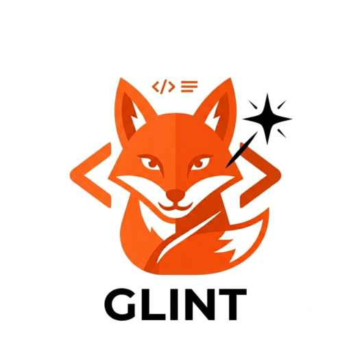

<p align="center">
  
</p>

<h1 align="center">glint</h1>

<p align="center">
  <a href="LICENSE"></a>
  <a href="CHANGELOG.md"></a>
</p>

> **Disclaimer:** This tool was built through iterative AI-assisted development with [Claude](https://claude.ai). It is experimental, incomplete, and not intended for production use. Coverage of GitLab CI keywords is best-effort and may lag behind GitLab's evolving spec. Use it at your own discretion — no correctness guarantees are made. Contributions and bug reports are welcome.

A local tool to validate and lint `.gitlab-ci.yml` pipelines without needing a GitLab server.

## Features

- **YAML validation** — detects malformed pipeline files early
- **Stage validation** — every job's `stage` must be declared in `stages`
- **`extends:` resolution** — resolves single and multi-level template inheritance before linting, so derived jobs are evaluated against their fully merged definition
- **`needs:` DAG validation** — checks that `needs:` references exist, respect stage ordering, and contain no circular dependencies
- **`dependencies:` validation** — checks that artifact dependency references exist and are in earlier stages
- **Keyword validation** — validates constraints on `when`, `parallel`, `retry`, `allow_failure`, `trigger`, `artifacts`, `cache`, `release`, `environment`, `coverage`, `rules`, and more
- **Remote project includes** — fetches `include: project:` templates from the GitLab API so extends/needs can be validated against the full merged pipeline
- **CI/CD catalog components** — resolves `include: component:` references from the GitLab CI/CD Catalog; public components work without a token
- **Deprecation warnings** — flags `only`/`except` usage in favour of `rules`
- **Local include resolution** — `include: local:` entries are read from disk and recursively merged before linting, so multi-file pipelines are fully validated
- **Extended variable declarations** — `variables:` entries may use the `{value, description, options}` map form (GitLab CI 13.7+); `default.image` accepts both string and map form; `rules.changes`/`rules.exists` accept both list and `{paths, compare_to}` map form
- **Graph output** — `glint graph` prints a job tree (stages → jobs) to the terminal; `glint graph includes` emits a Mermaid include dependency diagram; `glint graph pipeline` renders a GitLab CI-style PNG/SVG
- **Context simulation** — pass `--branch`, `--tag`, or `--source` to `glint check` or `glint graph` to see which jobs would be active, manual, or skipped for a specific pipeline event; evaluates `rules:if:` expressions and `only`/`except` filters
- **Variable expansion** — `$VAR` and `${VAR}` references inside variable values are expanded after all sources are merged (pipeline defaults → workflow-rule overrides → CLI flags); transitive chains resolve automatically; visible via `--list-vars`
- **Non-string variable scalars** — `BUILD: true`, `RETRIES: 3` and other bare boolean/integer variable values are handled correctly throughout: they render in `--list-vars` output and are injected into the evaluation context as their string equivalents, matching GitLab CI's behaviour
- **Static reachability (GL033)** — warns when a job's `rules:` block can never activate: if every rule has `when: never` the job is permanently excluded from any pipeline run, provable without evaluating any `if:` expressions
- **Sorted findings output** — findings are sorted by source file then line number, so all issues from the same file appear together in order; pipeline-level findings (no file) sort first
- **Consistent ruff-style warnings** — all warnings (unresolvable includes, skipped extends chains, workflow non-start) use the same `path: [warning] message` format as lint findings
- **`--version` / `-v` flag** — prints the compiled version string (e.g. `glint v0.2.14`); the version is also shown at the top of every `--help` output

See [ROADMAP.md](ROADMAP.md) for planned improvements.

## Requirements

- Go 1.21 or later
- [Task](https://taskfile.dev) (optional, for development tasks)

## Installation

```bash
git clone https://git.k3nny.fr/glint
cd glint
go build -o glint ./cmd/glint/...
```

Or with Task:

```bash
task build
```

## Usage

```
glint [OPTIONS] <COMMAND>

Commands:
  check    Lint a pipeline file — exits 0 (clean) or 1 (errors found)
  graph    Visualise the pipeline as a job tree or Mermaid graph
```

Run `glint <command> --help` for command-specific options and examples.

### `glint check`

```bash
glint check .gitlab-ci.yml
```

Exits `0` when no errors are found, `1` when at least one error is reported.

### Remote project includes

Pipelines that include templates from other GitLab projects are supported.
Provide a token so `glint` can fetch them:

```bash
# personal access token (read_api scope)
GITLAB_TOKEN=glpat-xxxx glint check .gitlab-ci.yml

# CI/CD job token (when running inside a pipeline)
CI_JOB_TOKEN=$CI_JOB_TOKEN glint check .gitlab-ci.yml

# self-hosted GitLab
GITLAB_TOKEN=glpat-xxxx GITLAB_URL=https://gitlab.example.com glint check .gitlab-ci.yml

# or via flags
glint check --token glpat-xxxx --gitlab-url https://gitlab.example.com .gitlab-ci.yml
```

**Project includes** require a token; without one they are skipped with a
warning and the rest of the pipeline is linted as-is.

**Component includes** (`include: component: ...`) attempt the fetch
unauthenticated, so public [CI/CD Catalog](https://gitlab.com/explore/catalog)
components work without a token. A warning is emitted if the fetch fails.

Token resolution order (first non-empty wins):

| Source | Header used |
|--------|-------------|
| `--token` flag / `GITLAB_TOKEN` | `PRIVATE-TOKEN` |
| `CI_JOB_TOKEN` | `JOB-TOKEN` |
| `GITLAB_PRIVATE_TOKEN` | `PRIVATE-TOKEN` |

Instance URL resolution order: `--gitlab-url` flag → `CI_SERVER_URL` →
`GITLAB_URL` → `https://gitlab.com`

### Component reference format

```
<host>/<project-path>/<component-name>@<version>

gitlab.com/components/secret-detection/secret-detection@v0.1.0
gitlab.com/my-org/ci-catalog/lint@main
gitlab.example.com/platform/components/build@~latest
```

The component file is looked up in order:
1. `templates/<component-name>.yml` (single-file layout)
2. `templates/<component-name>/template.yml` (directory layout)

Component input parameters (`with:`) are not validated — they are resolved by
GitLab at runtime. Jobs in fetched components may use `$[[ inputs.xxx ]]`
placeholders in fields like `stage`; `glint` skips those fields rather
than producing false positive errors.

### `glint graph`

Visualise the pipeline. Without a mode word, prints a job tree and the include
dependency graph separated by `---`.

```bash
# Default: job tree + include dependency graph
glint graph .gitlab-ci.yml

# Job tree only (stages → jobs, like the tree command)
glint graph tree .gitlab-ci.yml

# Include dependency graph → Mermaid flowchart to stdout
glint graph includes .gitlab-ci.yml > includes.mmd

# GitLab-like pipeline layout → PNG (or SVG fallback) written to --out dir
glint graph pipeline .gitlab-ci.yml
# prints the output file path, e.g.: glint-out/pipeline-20260607-143022.png

# Mermaid to stdout + pipeline file path to stderr
glint graph all .gitlab-ci.yml > includes.mmd

# Custom output directory (pipeline mode)
glint graph pipeline --out /tmp/graphs .gitlab-ci.yml
```

**Job tree** (`graph tree`) — stages as branches, jobs as leaves. Jobs with
`when: manual`, `when: delayed`, or `trigger:` are annotated in brackets.

**Include graph** (`graph includes`) — [Mermaid](https://mermaid.js.org) flowchart written to stdout.
Pipe to a `.mmd` file or paste into [mermaid.live](https://mermaid.live).
One node per include entry, colour-coded by type:
- Orange (bold): the main pipeline file
- Purple: `project:` includes
- Green: `component:` includes
- Blue: `local:` includes
- Grey: `remote:` URL includes
- Light orange: GitLab-provided `template:` includes

**Pipeline graph** (`graph pipeline`) — GitLab CI-style SVG rendered to a timestamped file
in the `--out` directory (default: `glint-out/`). Converted to PNG automatically
when `rsvg-convert`, `inkscape`, or `magick` is available; falls back to SVG otherwise.
Jobs are colour-coded by type:
- Blue (`#1f75cb`): regular jobs
- Orange (`#fc6d26`): `when: manual` jobs
- Purple (`#6b4fbb`): `trigger:` jobs
- Amber (`#fca326`): `when: delayed` jobs

DAG mode (job-to-job Bézier arrows) activates automatically when any job has a `needs:` list.
Classic mode draws L-shaped or straight connectors between stage columns otherwise.

### Context simulation

Pass `--branch`, `--tag`, or `--source` to `glint check` to see which jobs
would run for a given pipeline event. The pipeline is still fully linted;
context output is printed first.

```bash
# What runs on a push to develop?
glint check --branch develop .gitlab-ci.yml

# What runs when a v1.2.0 tag is pushed?
glint check --tag v1.2.0 .gitlab-ci.yml

# Merge request pipeline
glint check --source merge_request_event .gitlab-ci.yml

# Arbitrary variable overrides (repeatable)
glint check --branch main --var DEPLOY_ENV=production .gitlab-ci.yml
```

**Evaluated:**
- `rules:if:` — full expression language: `==`, `!=`, `=~`, `!~`, `&&`, `||`, `!`, `()`, `$VAR`, string literals, `null`
- `only:` / `except:` — ref keywords (`branches`, `tags`, `merge_requests`, `schedules`, …), branch name globs (`feat/*`), and `/regex/` patterns
- Variable expansion — `$VAR` / `${VAR}` references within variable values are expanded after all sources are merged; use `--list-vars` to inspect the resolved values

**Not evaluated** (no git tree at lint time): `rules:changes:`, `rules:exists:`.
Rules without an `if:` clause always match.

**Predefined variables** set automatically by the shortcut flags:

| Flag | Variables populated |
|------|---------------------|
| `--branch <name>` | `CI_COMMIT_BRANCH`, `CI_COMMIT_REF_NAME`, `CI_COMMIT_REF_SLUG`, `CI_PIPELINE_SOURCE=push` |
| `--tag <name>` | `CI_COMMIT_TAG`, `CI_COMMIT_REF_NAME`, `CI_COMMIT_REF_SLUG`, `CI_PIPELINE_SOURCE=push` (clears `CI_COMMIT_BRANCH`) |
| `--source <event>` | `CI_PIPELINE_SOURCE` |
| `--var KEY=VALUE` | any variable; overrides shortcuts |

### Example output

```
# Clean pipeline (implicit default: --branch main --source push)
Context: branch=main, source=push

Active  (5): build, deploy-staging, test, ...

OK: .gitlab-ci.yml — no issues found (5 job(s), 3 stage(s))

# With --branch develop context
Context: branch=develop, source=push

Active  (3): build, deploy-staging, test
Skipped (2): deploy-prod, release-notes

OK: .gitlab-ci.yml — no issues found (5 job(s), 3 stage(s))

# With --tag v1.0.0 context
Context: tag=v1.0.0, source=push

Active  (4): build, deploy-prod, release-notes, test
Skipped (1): deploy-staging

OK: .gitlab-ci.yml — no issues found (5 job(s), 3 stage(s))

# Pipeline with issues
.gitlab-ci.yml:14: GL004 [error] job "deploy": stage "production" is not defined in 'stages'
.gitlab-ci.yml:22: GL027 [error] job "test": needs unknown job "build-app"
.gitlab-ci.yml:31: GL007 [warning] job "old-job": 'only'/'except' are deprecated; prefer 'rules'

3 finding(s): 2 error(s)
```

## Lint rules

Every finding includes a stable rule ID (e.g. `GL003`) that can be used to filter output or reference a specific check in documentation.

### Pipeline-level

| ID | Severity | Rule |
|----|----------|------|
| GL002 | ERROR | `workflow.rules[*].when` is not `always` or `never` |
| GL001 | WARNING | No `stages` defined (GitLab falls back to default stages) |

### Job-level — structure

| ID | Severity | Rule |
|----|----------|------|
| GL003 | ERROR | Job is missing required `script` (or `run`) — non-trigger, non-template jobs |
| GL004 | ERROR | Job references a `stage` not declared in `stages` |
| GL005 | ERROR | `only` and `rules` used together on the same job |
| GL006 | ERROR | `except` and `rules` used together on the same job |
| GL007 | WARNING | `only`/`except` used (deprecated, prefer `rules`) |

### Job-level — keyword constraints

| ID | Severity | Rule |
|----|----------|------|
| GL008 | ERROR | `when` is not one of `on_success`, `on_failure`, `always`, `manual`, `delayed`, `never` |
| GL009 | ERROR | `when: delayed` without `start_in` |
| GL010 | ERROR | `start_in` set but `when` is not `delayed` |
| GL011 | ERROR | `parallel` integer not in range 2–200, or map form missing `matrix` key |
| GL012 | ERROR | `retry` integer not in range 0–2, or `retry.max` out of range |
| GL013 | ERROR | `retry.when` contains an unrecognised failure type |
| GL014 | ERROR | `allow_failure` is not a boolean or a map with `exit_codes` |
| GL015 | ERROR | `interruptible` is not a boolean |
| GL016 | ERROR | `trigger` job also has `script` |
| GL017 | ERROR | `trigger` map missing `project` or `include` |
| GL018 | ERROR | `coverage` is not a regex pattern wrapped in `/` |
| GL019 | ERROR | `release` missing required `tag_name`, or is not a map |
| GL020 | ERROR | `environment.url` set without `environment.name`, or invalid `environment.action` |
| GL021 | ERROR | `artifacts.when` invalid, or `artifacts.expose_as` set without `artifacts.paths` |
| GL022 | WARNING | `pages` job `artifacts.paths` does not include `public` |
| GL023 | ERROR | `cache.when` or `cache.policy` has an invalid value |
| GL024 | ERROR | `rules[*].when` is not one of the valid `when` values |
| GL025 | ERROR | `image` map form missing `name` key |
| GL026 | ERROR | `inherit.default` / `inherit.variables` is not a boolean or list |

### Cross-job graph

| ID | Severity | Rule |
|----|----------|------|
| GL027 | ERROR/WARNING | `needs:` references a job that does not exist (WARNING when `optional: true`) |
| GL028 | ERROR | `needs:` references a job in a later stage |
| GL029 | ERROR | Circular dependency detected in `needs:` graph |
| GL030 | ERROR | `dependencies:` references a job that does not exist |
| GL031 | ERROR | `dependencies:` references a job in the same or a later stage |

### Expression validation

| ID | Severity | Rule |
|----|----------|------|
| GL032 | WARNING | `rules:if:` references `$VAR` not declared in `variables:` (pipeline, job, or `workflow:rules:variables:`) — may be a false positive for variables set in GitLab CI/CD project settings |
| GL033 | WARNING | Every rule in `rules:` has `when: never` — job is permanently excluded from the pipeline (statically provable without context) |

### Hidden jobs (templates)

Jobs whose name starts with `.` are treated as reusable templates and skipped for most rules. This matches GitLab's own behaviour.

## Development

This project uses [Task](https://taskfile.dev) as a task runner.

```bash
task              # list available tasks
task build        # compile the binary
task test         # run Go unit tests
task lint-go      # run go vet
task validate     # run the binary against all testdata fixtures
task ci           # full check: vet → test → build → validate
task build-windows  # cross-compile for Windows x64 (requires a tagged commit → glint-<tag>.exe)
task build-linux    # cross-compile for Linux x64 (requires a tagged commit → glint-<tag>-linux-amd64)
task clean        # remove build artifacts
```

## Project structure

```
.
├── cmd/glint/     # CLI entrypoint
├── internal/
│   ├── cicontext/      # CI variable context, rules:if: evaluator, job reachability
│   ├── fetcher/        # GitLab API client (project include fetching)
│   ├── graph/          # Mermaid and SVG/PNG graph generators
│   ├── linter/         # lint rules and findings
│   ├── model/          # pipeline data structures and YAML parser
│   └── resolver/       # extends: resolution and project include merging
├── testdata/           # sample pipelines used for manual validation
├── Taskfile.yml
└── go.mod
```
